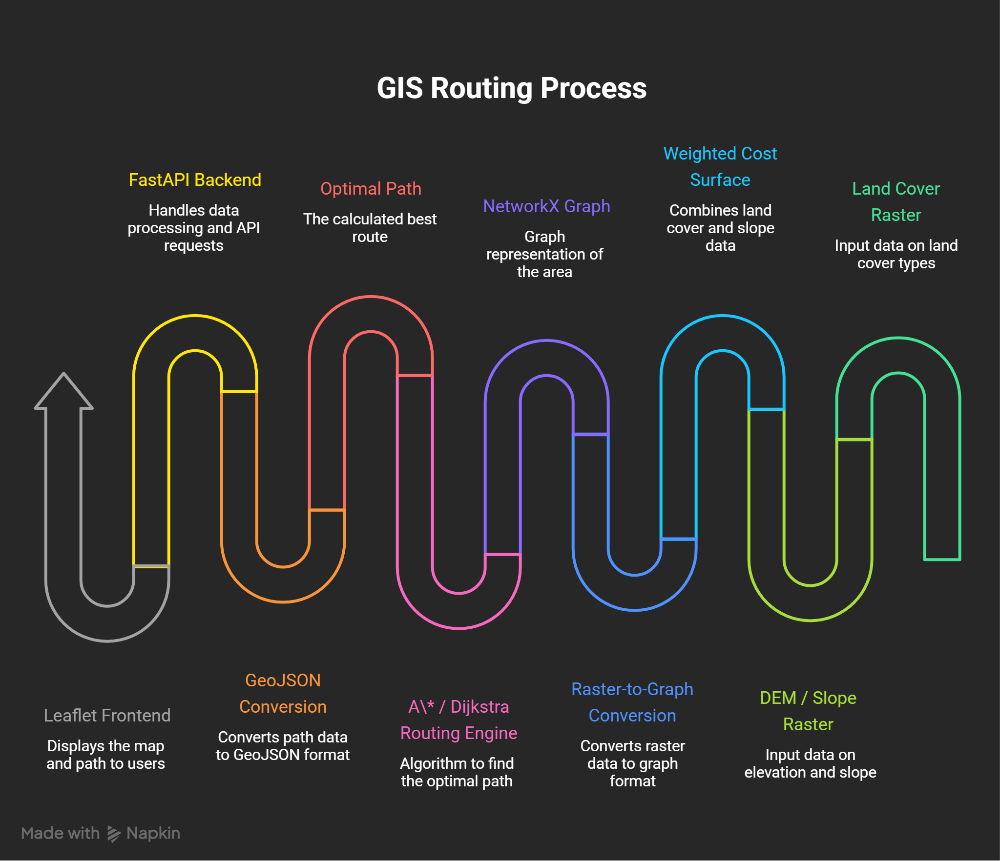
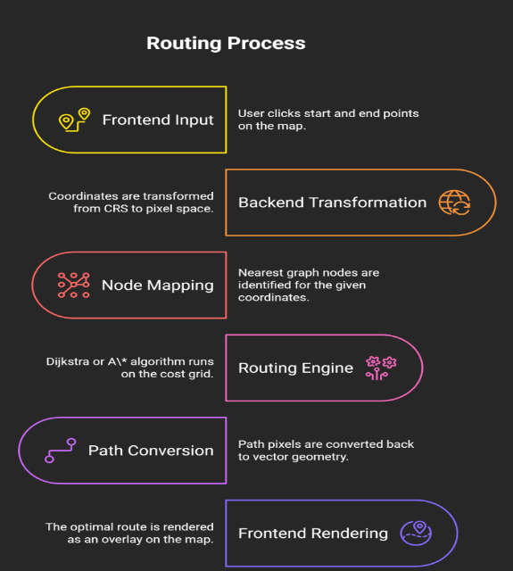

# EcoRoute

> AI-assisted geospatial infrastructure route optimization using weighted cost surfaces, graph search algorithms, and interactive GIS visualization.

EcoRoute is a full-stack geospatial routing system that computes environmentally and economically efficient infrastructure routes across large geographic regions. Instead of minimizing only physical distance, EcoRoute models real-world terrain by assigning traversal costs to different land-cover classes and slope conditions, producing routes that better reflect practical engineering constraints.

The routing engine transforms geospatial raster data into a weighted graph containing over **3.2 million nodes**, enabling optimal path computation using **A\*** and **Dijkstra's Algorithm**. Computed routes are served through a FastAPI backend and visualized interactively on a Leaflet-based web application.

---

## Features

- Weighted cost-surface based route optimization
- Graph-based routing over millions of geospatial nodes
- A* and Dijkstra shortest-path algorithms
- Terrain-aware routing using land-cover and slope constraints
- Interactive GIS visualization with Leaflet
- FastAPI backend for routing requests
- Raster-to-graph conversion using NetworkX
- GeoJSON route generation for frontend rendering
- Coordinate transformation between geographic and pixel space
- Modular architecture for supporting multiple infrastructure planning applications

---

## Motivation

Traditional shortest-path algorithms optimize only distance, often producing routes that cross environmentally sensitive areas, steep terrain, water bodies, or densely populated regions.

EcoRoute instead formulates routing as a **least-cost path optimization problem**, where every raster cell contributes a traversal cost based on engineering feasibility and environmental impact.

This allows the routing engine to produce infrastructure corridors that are significantly more realistic than simple Euclidean shortest paths while remaining computationally efficient on large-scale geospatial datasets.

---

## Applications

EcoRoute is designed as a reusable geospatial routing engine and can support infrastructure planning tasks such as:

- Power transmission corridors
- Pipeline routing
- Highway planning
- Railway alignment
- Fiber optic deployment
- Utility corridor optimization
- Environmental impact assessment

---

## System Architecture

<p align="center">
  
</p>

The EcoRoute architecture consists of four major components:

1. **Frontend** – Interactive Leaflet-based map interface for selecting source and destination points.
2. **Backend API** – FastAPI service responsible for coordinate transformation, graph traversal, and response generation.
3. **Routing Engine** – Performs least-cost path computation using A* or Dijkstra over a weighted graph.
4. **Geospatial Data Layer** – Stores land-cover, slope, cost surface, and serialized graph data used during routing.

---

## Routing Workflow

<p align="center">
  
</p>

A routing request passes through the following stages:

1. User selects start and destination points.
2. Geographic coordinates are converted into raster pixel coordinates.
3. The nearest graph nodes are identified.
4. The routing engine computes the least-cost path.
5. The resulting path is converted into geographic coordinates.
6. The route is returned as GeoJSON and rendered on the interactive map.

---

## Technology Stack

| Category | Technologies |
|----------|--------------|
| Backend | FastAPI, Python |
| Frontend | HTML, CSS, JavaScript, Leaflet.js |
| Geospatial Processing | Rasterio, GDAL, NumPy |
| Graph Processing | NetworkX |
| Routing Algorithms | A*, Dijkstra |
| Data Formats | GeoTIFF, GeoJSON |
| Coordinate Systems | WGS84 (EPSG:4326), UTM (EPSG:32645) |

---

## Cost Surface Generation

<p align="center">
  
</p>

The routing engine operates on a weighted traversal surface derived from land-cover and terrain information. Each raster cell is assigned an engineering cost representing construction difficulty or environmental impact. Water bodies and steep terrain are treated as non-traversable regions, forcing the routing algorithm to search for feasible alternatives.

EcoRoute models route planning as a **least-cost path optimization** problem rather than a shortest-distance problem.

Each raster cell is assigned a traversal cost that reflects the engineering feasibility of constructing infrastructure through that location. The final cost surface combines information from land-cover classification and terrain slope, allowing the routing engine to avoid environmentally sensitive or physically challenging regions.

The overall traversal cost is computed as a weighted combination of:

- Land-cover cost
- Terrain slope cost

Water bodies and other restricted regions are assigned prohibitively large costs, effectively making them non-traversable during path computation.

### Land-Cover Cost

| Land Cover | Cost |
|------------|-----:|
| Barren Land | 1 |
| Shrubland / Grassland | 2 |
| Agricultural Land | 5 |
| Dense Vegetation | 8 |
| Urban Areas | 10 |
| Water Bodies | 9999 |

### Slope Cost

| Terrain Slope | Cost |
|--------------|-----:|
| ≤ 5° | 1 |
| ≤ 10° | 3 |
| ≤ 15° | 6 |
| ≤ 25° | 9 |
| > 25° | 9999 |

The weighted cost surface serves as the foundation for graph construction and route optimization.

---

## Raster-to-Graph Conversion

Once the cost surface has been generated, it is transformed into a weighted graph using **NetworkX**.

Each traversable raster cell becomes a graph node connected to its four neighboring cells (up, down, left, and right). Edge weights are calculated as the average traversal cost of the two connected cells:

\[
w(u,v)=\frac{Cost(u)+Cost(v)}{2}
\]

This representation preserves the spatial relationships present in the raster while enabling the use of classical shortest-path algorithms.

### Graph Statistics

| Property | Value |
|----------|------:|
| Raster Size | 1316 × 2461 |
| Nodes | ~3.24 Million |
| Edges | ~6.47 Million |
| Serialized Graph Size | 361 MB |
| Graph Construction Memory | ~7 GB RAM |
| Graph Loading Memory | ~5.2 GB RAM |

---

## Route Optimization

EcoRoute supports two graph search algorithms:

- Dijkstra's Algorithm
- A* Search

Both algorithms compute optimal least-cost routes over the weighted graph.

### Dijkstra's Algorithm

Dijkstra explores the graph uniformly, guaranteeing the globally optimal route. Although reliable, it often expands a large number of nodes before reaching the destination, increasing computation time on large graphs.

### A* Search

A* incorporates a Manhattan-distance heuristic to guide exploration toward the destination. By prioritizing promising nodes, it significantly reduces the search space while maintaining route optimality.

For large routing problems, A* generally provides faster execution without sacrificing solution quality.

---

## Backend Pipeline

The FastAPI backend coordinates the routing process from user input to route visualization.

### Request Flow

1. Receive source and destination coordinates from the frontend.
2. Convert geographic coordinates into raster pixel coordinates.
3. Locate the nearest graph nodes.
4. Execute the selected routing algorithm.
5. Convert the resulting node sequence back to geographic coordinates.
6. Generate a GeoJSON LineString.
7. Return the route to the frontend for visualization.

The backend loads the serialized graph only once during application startup, minimizing latency for subsequent routing requests.

---

## Performance

EcoRoute was evaluated on a large geospatial graph generated from a weighted cost surface containing over **3.2 million nodes** and **6.4 million edges**. Both Dijkstra's Algorithm and A* Search were benchmarked on identical routing tasks to compare computational efficiency while preserving optimality.

### Graph Performance

| Metric | Value |
|---------|-------|
| Raster Dimensions | 1316 × 2461 |
| Graph Nodes | ~3.24 Million |
| Graph Edges | ~6.47 Million |
| Serialized Graph Size | 361 MB |
| Graph Loading Time | 14.47 s |
| Graph Construction Memory | ~7 GB RAM |
| Graph Loading Memory | ~5.2 GB RAM |

---

### Routing Performance

Both algorithms consistently produced identical optimal routes. However, A* reduced computation time on most routing tasks by directing the search toward the destination using a Manhattan-distance heuristic.

| Algorithm | Average Runtime |
|------------|----------------:|
| Dijkstra | 13.06 s |
| A* Search | 11.20 s |

---

### Observations

- Both algorithms generated identical least-cost routes.
- A* generally reduced search time by prioritizing nodes closer to the destination.
- Dijkstra occasionally outperformed A* in regions containing numerous high-cost barriers, where the heuristic provided limited guidance.
- For large-scale routing problems with moderate obstacle density, A* offered the best balance between optimality and execution time.

These benchmarks demonstrate that EcoRoute is capable of efficiently performing route optimization over multi-million-node geospatial graphs while maintaining optimal routing accuracy.

---

## Installation 

### Clone the Repository

```bash
git clone https://github.com/yourusername/EcoRoute.git
cd EcoRoute
```

### Create a Virtual Environment

```bash
python -m venv venv
```

Activate the environment.

**Windows**

```bash
venv\Scripts\activate
```

**Linux / macOS**

```bash
source venv/bin/activate
```

### Install Dependencies

```bash
pip install -r requirements.txt
```

---

## Running the Application

Start the FastAPI server.

```bash
uvicorn main:app --reload
```

Open the frontend in your browser and select the source and destination points on the interactive map. EcoRoute computes the least-cost path and renders the optimized route as a GeoJSON overlay.

---

## Future Improvements

- Eight-directional graph connectivity
- Multi-objective route optimization
- Dynamic environmental constraints
- Real-time LULC Label prediction integration
- GPU-accelerated graph search
- Support for additional infrastructure planning scenarios
- Multi-user web deployment
